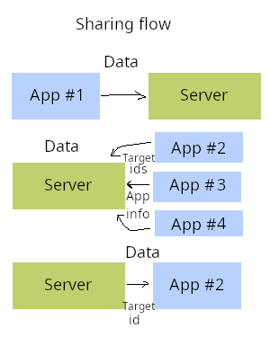

Sharing Portal POC
-----

A POC prototype for a sharing portal complete with a rough spec proposal.

This program uses Qt for implementation and share-interface uses kirigami.

View individual subfolders for instructions.

[demo](https://youtu.be/pMiNbnUZOQM)

[dynamic demo](https://youtu.be/aN_kOiUlxbo)
